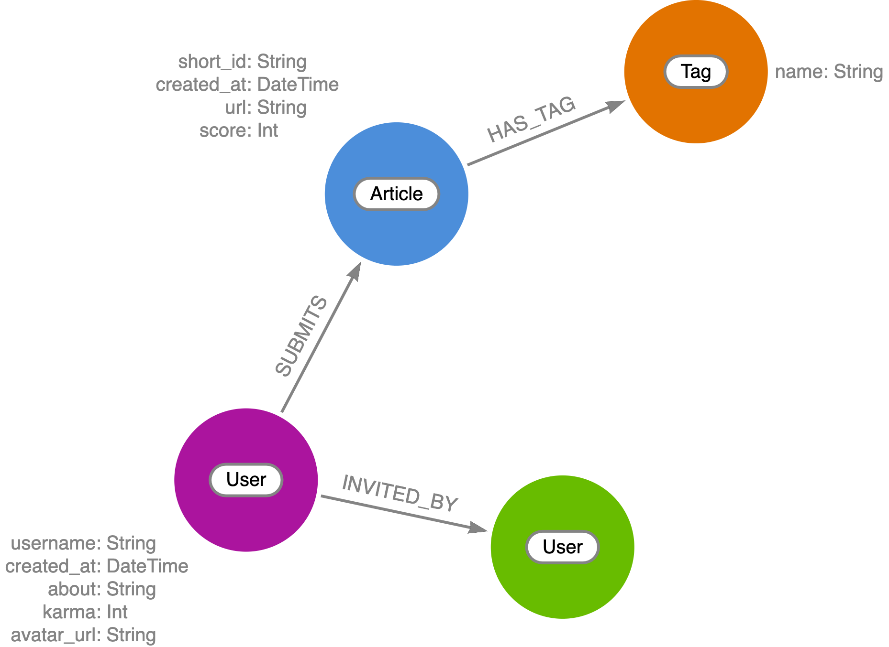

# Lobsters Graph

This is a fullstack application built using Neo4j Aura, GraphQL, & Next.js to demonstrate the power of graph visualization and social network data using data from the [Lobsters](https://lobste.rs/) social news aggregator.

## Livestream Series

This application is being built live on the [Neo4j livestream.](https://twitch.tv/neo4j) You can join live or find the recordings and write ups below:

* **No Code Data Scraping With GitHub Actions & Neo4j Aura** - [[blog post](https://lyonwj.com/blog/no-cost-data-scraping-github-actions-neo4j-aura), [video recording](https://www.youtube.com/watch?v=jAweyWeO2cM)]

## Graph Data Model

## Data Import

The Lobsters newest and hottest JSON endpoints are scraped each hour using GitHub Actions and Neo4j Aura. See [/.github/workflows/lobsters.yml](/.github/workflows/lobsters.yml)
